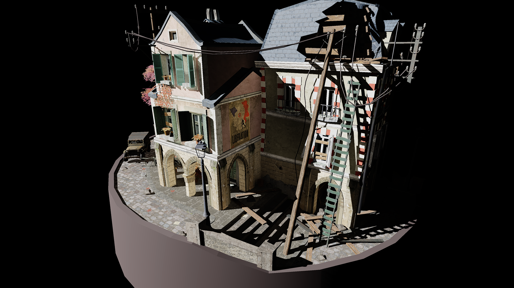

## Indirect lighting through irradiance probes

<p align="center">
     <br>
    Exposure corrected final result
</p>

## Table of contents

- [Indirect lighting through irradiance probes](#indirect-lighting-through-irradiance-probes)
- [Table of contents](#table-of-contents)
- [Introduction](#introduction)
    - [Why indirect illumination?](#why-indirect-illumination)
- [Theory](#theory)
  - [Abstract](#abstract)
- [Implementation](#implementation)
  - [Reducing the irradiance memory print](#reducing-the-irradiance-memory-print)
  - [Generating cubemaps](#generating-cubemaps)
  - [From position to irradiance probe](#from-position-to-irradiance-probe)
  - [Taking this a step further](#taking-this-a-step-further)
    - [Using a ray-tracer to get radiance values](#using-a-ray-tracer-to-get-radiance-values)
    - [Encoding visibility](#encoding-visibility)
    - [Screen space ambient occlusion](#screen-space-ambient-occlusion)
    - [Reflections](#reflections)
- [Sources](#sources)

## Introduction
This blog post was written as part of my grading for the given feature I had to implement. I have written this post to condense the research and implementation into a single readable format. As this post expands beyond what I will be graded for I hope you will be able to learn and gain some insights from this article.

#### Why indirect illumination?

This school project of mine needed me to learn the necessary skills for a chosen industry position. I chose the position of graphics programmer at Naughty Dog and oriented my project about approximating indirect illumination. As I learned from Naughty Dog at Siggraph 2020[[1]](#source1) they use a probe based lighting scheme for indirect illumination so this is what I based my implementation on.


## Theory

### Abstract
The problem we're solving here is approximating indirect illumination in a way that better simulates light bouncing through the scene instead of a flat ambient term. Tons of research has already been poured into this problem. I have assembled an implementation based on several different research papers and implementations (see [sources](#sources))

**[TODO insert picture comparing flat ambient term to indirect illumination]**

_Insert section talking about spherical harmonics_

_Insert section talking about integrating over the hemisphere_

_Insert section talking about interpolating between probes on a regular grid? (or is this more implementation oriented?)_

## Implementation

The implemenation of this requires some rewriting in pseudo code as it was fully created on a certain next gen hardware platform from a japanese company. With this limitation in mind I hope there is still ssomething to take away from reading this

The base of this project can be found in the codebase as a continuation from the previous project I had to complete (A PBR renderer, lit through IBL). This meant the entire pipeline for lighting through image based data was already in place. I will briefly go over this process.

The pipeline for drawing IBL constituted of these resources:

**[TODO show resources]**

If you want to read more on the steps that go into IBL and it's implementation I recommend these resources:

[LearnOpenGL](https://learnopengl.com/PBR/Theory)<br>
[Google's Filament](https://google.github.io/filament/Filament.md.html)

### Reducing the irradiance memory print

Now one change I've made to the IBL for the irradiance probes are storing the diffuse data as a set of 2nd order spherical harmonics instead of the cubemap representation. This reduced the memory footprint for the diffuse data to 9 3-component vectors. or in shader language.
```C++
struct SH9Irradiance
{
    float3 band0_0;
    float3 band1_n1, band1_n0, band1_p1;
    float3 band2_n2, band2_n1, band2_0, band2_p1, band2_p2;
};
```

A single probe is then represented like this

```C++
struct Probe
{
    SH9Irradiance IrradianceCoefficients;
    float3 Position;
}
```

### Generating cubemaps

I assume the reader is knowledgeable in the basic of graphics programming and knows how to rasterizer the scene to a cubemap, ([Basic cubemap drawing example for the ambitious novices]([https://www.learnopengl.com/Advanced-Lighting/Shadows/Point-Shadows)). 

### From position to irradiance probe

The pipeline for baking probes consist of a two step process:
- Generate a cubemap
- Use this cubemap to compute spherical harmonics

```C++
[NumThreads(1, 1, 1)]
void main(DTid.x : SEMANTIC_GLOBAL_THREAD_ID)
{
	uint index = DTid.x;

	SH9Irradiance irrOut = {};

	float weight, weightSum = 0.0f;
	for(uint face = 0; face < 6; face++)
	{
		for(uint x = 0; x < Resolution; x++)
		{
			for(uint y = 0; y < Resolution; y++)
			{
				float u = (x + 0.5f) / (float)Resolution;
				float v = (y + 0.5f) / (float)Resolution;
				u = u * 2.0f - 1.0f;
				v = v * 2.0f - 1.0f;
	
				float temp = 1.0f + u*u + v*v;
				weight = 4.0f/(sqrt(temp) * temp);
	
				float3 normal = GetCubefaceSamplingVector((int)face, float2(u, v));

				float3 irradiance = Cubemaps[index].Sample(sampler, normal).rgb;
				irrOut += GenerateIrradianceCoefficientsFromNormal(normal, irradiance) * weight;

				weightSum += weight;
			}
		}
	}

	irrOut *= 4.0f * PI / weightSum;

	srtinst.Probes[index].IrradianceCoefficients = irrOut;
}
```

### Taking this a step further

Alternative features that can be implemented to improve/enhance the algorihtm. Serving as inspiration to the reader as well as a list for myself to implement outside of what the 7 weeks of school work allowed me to do

#### Using a ray-tracer to get radiance values

Currently we generate a cubemap per probe and sample the radiance as a pixel in the texture. We could also spawn some rays per probe and use these radiance values to compute the harmonics.This process is very similair to what Nvidia uses in their real-time hardware accelerated ray-tracing  global illumination algorithm[[2]](#source2)

#### Encoding visibility

The implementation only naively discards probes based on a surface normal test. This is far from sufficient in reducing light leaks. We can encode depth information in a 2d texture that maps the normals of a sphere to an unfolded octahedron[[3]](#source3). Eliminating many cases where a probe is inside geometry.

#### Screen space ambient occlusion

To better embed objects in the scene screen space ambient occlusion is a great way to create a cohesion between objects close together.

#### Reflections
The implementation currently only supports diffuse irradiance data. A nice addition to handle more complex scenes would be a way to handle reflections. I'll list several options here:
- Stochastic screen space reflections[[4]](#source4)
- Raytraced reflections
- Automatic or manually placed reflection probes

## Sources
[1] <a id="source1" /> https://www.naughtydog.com/blog/naughty_dog_at_siggraph_2020 <br>
[2] <a id="source2" /> https://developer.nvidia.com/rtx/ray-tracing/rtxgi <br>
[3] <a id="source3" /> https://research.nvidia.com/publication/2017-02_real-time-global-illumination-using-precomputed-light-field-probes <br>
[4] <a id="source4" /> https://www.ea.com/frostbite/news/stochastic-screen-space-reflections